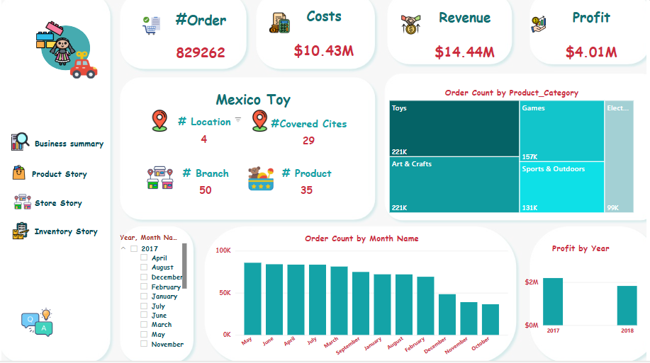
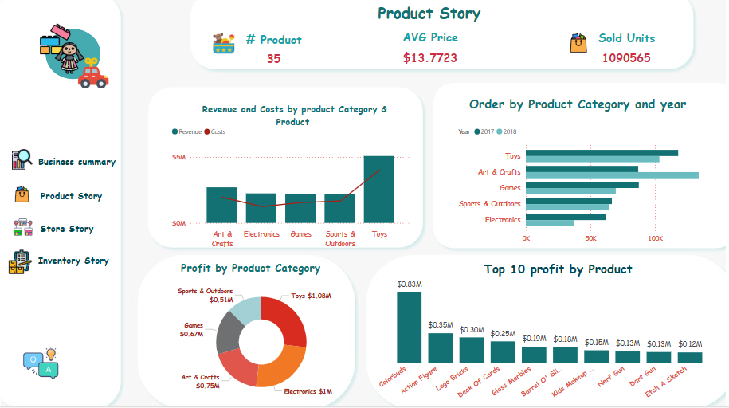
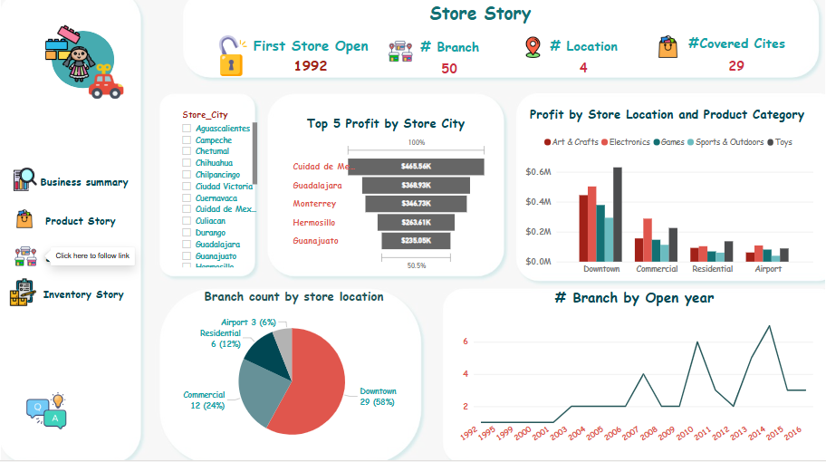
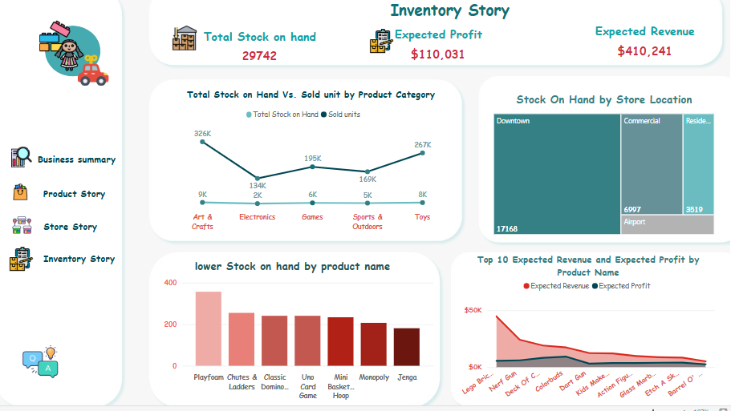

# 📊 Mexico Toy Sales Dashboard

This project is an *interactive multi-page dashboard* designed for a toy retail company operating in Mexico. The dashboard provides comprehensive insights into sales performance, product profitability, store operations, and inventory status. It is structured across four main pages, each focusing on a specific business area.

## 🔥 Key Features
- *Total Orders*: 829,262  
- *Revenue*: $14.44M  
- *Profit*: $4.01M  
- *Sold Units*: 1,090,565  
- *Branches*: 50 across 29 cities  

---

## 🗂 Dashboard Pages

### 1. Business Summary
- High-level KPIs: Orders, Costs, Revenue, Profit.
- Order count breakdown by product category.
- Monthly order trends.
- Profit comparison by year.
- Geographic coverage across Mexico (locations, branches, covered cities).

### 2. Product Story
- Product portfolio insights (35 products).
- Average price and sold units.
- Revenue and cost comparison by category.
- Profit breakdown by product category.
- Top 10 most profitable products.
- Orders by product category and year.

### 3. Store Story
- Store operations overview since 1992.
- Top 5 cities by store profit.
- Profit breakdown by store location and product category.
- Branch distribution (Downtown, Commercial, Residential, Airport).
- The branch count trend is by the year of opening.

### 4. Inventory Story
- Key inventory KPIs: total stock on hand, expected profit, and expected revenue.
- Breakdown of stock availability across store locations.
- Identification of products with critically low stock levels.
- Analysis of stock on hand versus sold units across product categories.
- Highlight of top 10 products by expected revenue and expected profit.

---

## 🛠 Tools Used
- *Power BI* for dashboard design and interactive visuals.
- *DAX* for calculations (KPIs, profit, revenue).
- *Power Query* for data preparation and transformation.
- *Mexico Toy Sales dataset* from Maven Analytics, used as the data source for this project.

---

## 🎯 Objective
To help stakeholders (management, sales, and inventory teams) track business performance, optimize inventory, and identify high-profit areas across products and store locations.

---

## 📎 Notes
- The dashboard is structured to allow slicing by year, month, city, and product category for deeper analysis.
- It is optimized for decision-making in retail business strategy and inventory management.
  

## 🔗 Project Link
You can view the full project with visuals on my GitHub repository:  
[👉 Click here to view the dashboard project](https://project.novypro.com/LMkEwd)

---

## 🖼️ Screenshots

| Business Summary | Product Story |
|------------------|---------------|
|  |  |

| Store Story | Inventory Story |
|------------------|---------------|
|  |  |
